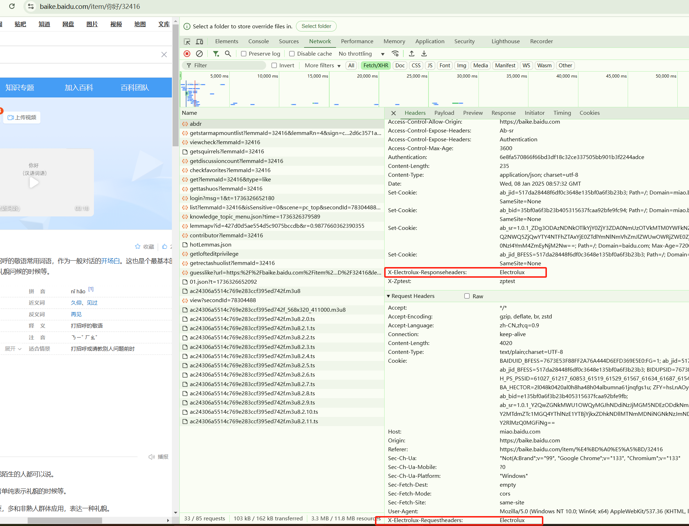

# simple-modify-headers-v3

# 前言

最近在写 rpa相关的东西，在动态对某一些网页进行注入的时候，发现响应头带了csp（content-secure-policy）这类请求头，导致script注入有问题，

报错如下


非常苦恼，然后就去调研如何对网页的请求响应头进行代理，

在v2用的是webrequest这个api,可惜现在v2寄了，无奈只能用v3， 调试起来很恐怖，很简单的代码写了两天，一直在踩雷

老规矩先看文档

https://developer.chrome.com/docs/extensions/reference/api?hl=zh-cn

再看相关的issue

1. ui的显示错误，只有请求头被修改：https://issues.chromium.org/issues/40196848 还有 https://groups.google.com/a/chromium.org/g/chromium-extensions/c/Sc-ssQsSj94
3. 重启后，没有拦截到request和response header：https://github.com/requestly/modify-headers-manifest-v3/issues/1


所幸的是， 第一点错误我并没有遇到，但是第二个问题困扰我好久，最后我经过试验得到结论，由于浏览器是多进程的， 浏览器插件有时会比页面还慢加载，这导致了有一些请求在一开始并不能被监听拦截到，但是如果启动了一段时间后，插件进程被完全加载后就没问题了，这点在咱们编写脚本尤其需要注意


# 开发

完整代码见: https://github.com/electroluxcode/simple-modify-headers-v3

## manifest.json

首先在 `manifest.json` 中 的 `permissions` 去申请权限，最核心的是 

`manifest.json`  示例如下

```json
{
  "name": "simple-modify-headers-v3",
  "version": "0.1",
  "manifest_version": 3,
  "description": "",
  "icons": {
  },
  "author": "Electrolux",
  "permissions": [
    "declarativeNetRequestFeedback",
    "declarativeNetRequest",
    "declarativeNetRequestWithHostAccess"
  ],
  "declarative_net_request": {
    "rule_resources": [
      {
        "id": "ruleset_",
        "enabled": true,
        "path": "rule.json"
      }
    ]
  },
 
  "background": {
    "service_worker": "js/background.js"
  },
  "host_permissions": [
    "<all_urls>"
  ]
}

```


## rules.json

<https://developer.chrome.com/docs/extensions/reference/declarativeNetRequest/> 

json 格式示例长这样, 其中 operation 支持 append ，remove， set三个操作，更多参数参考上方文档


```json
[
    {
        "id": 1,
        "priority": 1,
        "action": {
            "type": "modifyHeaders",
            "responseHeaders": [
               {
                    "header": "X-Electrolux-responseHeaders",
                    "operation": "set",
                    "value": "Electrolux"
                }
    
            ],
            "requestHeaders": [
            {
                    "header": "X-Electrolux-requestHeaders",
                    "operation": "set",
                    "value": "Electrolux"
                }
    
            ]
            
        },
        "condition": {
            "resourceTypes": [
                "csp_report", 
                "font", 
                "image", 
                "main_frame", 
                "media", 
                "object", 
                "other", 
                "ping", 
                "script", 
                "stylesheet", 
                "sub_frame", 
                "webbundle", 
                "websocket", 
                "webtransport", 
                "xmlhttprequest"]
          }
    }
]

```


## background.js

主要是调用 chrome.declarativeNetRequest.updateDynamicRules 这个函数，这里给一个简单的示例

```js
console.log("background.js loaded")

console.log(chrome)
	
const rules = [
    {
        "id": 1,
        "priority": 1,
        "action": {
            "type": "modifyHeaders",
            "responseHeaders": [
                {
                    "header": "content-security-policy",
                    "operation": "remove"
                },
                {
                    "header": "content-security-policy-report-only",
                    "operation": "remove"
                },
                {
                    "header": "Content-Security-Policy",
                    "operation": "remove"
                },{
                    "header": "X-Zptest",
                    "operation": "set",
                    "value": "zptest"
                }
    
            ],
            
        },
        condition: {
            resourceTypes: ['csp_report', 'font', 'image', 'main_frame', 'media', 'object', 'other', 'ping', 'script', 'stylesheet', 'sub_frame', 'webbundle', 'websocket', 'webtransport', 'xmlhttprequest'],
          }
    }
]
chrome.declarativeNetRequest.updateDynamicRules({
  removeRuleIds: rules.map((rule) => rule.id), // remove existing rules
  addRules: rules
});

```


## 验证


最后随便拿一个网站验证一下，验证成功

